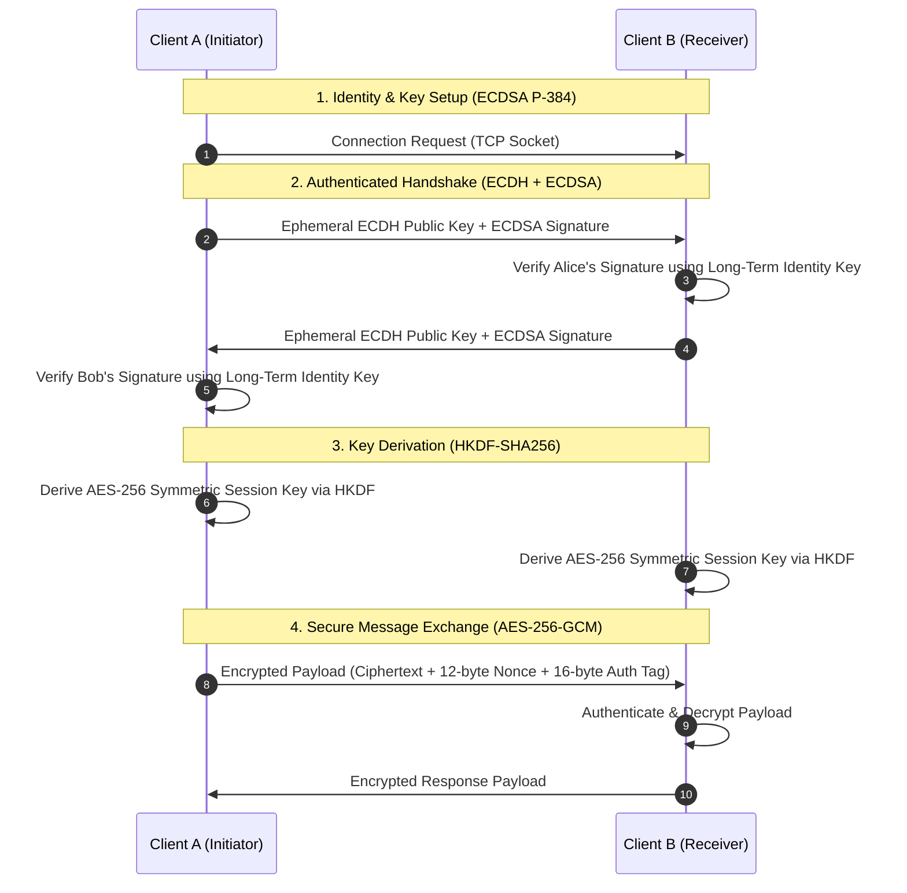

# End-to-End Encrypted (E2EE) Chat Application

[](https://www.python.org/)
[](LICENSE)
[](#)

A peer-to-peer End-to-End Encrypted (E2EE) chat application demonstrating core cryptographic protocols for secure communication. Built with Python sockets and a modern Flask web interface, this application showcases forward secrecy, mutual peer authentication, and authenticated symmetric encryption.

> [!NOTE]
> **Educational Demonstration**: This project is intended for educational and research purposes to demonstrate real-world cryptographic handshakes and message security over raw TCP sockets.

---

## 🔒 Security Architecture & Cryptographic Flow



---

## ✨ Core Features

* **Authenticated Key Exchange**: Uses **ECDH** (SECP384R1 curve) for ephemeral session key negotiation, mutually authenticated via **ECDSA** (SECP384R1, SHA-256) signatures to prevent Man-in-the-Middle (MitM) attacks.
* **Forward Secrecy**: Generating ephemeral keypairs for every session ensures that past session traffic cannot be decrypted even if long-term signing keys are ever compromised.
* **Symmetric Message Confidentiality**: Fast, secure message encryption with **AES-256-GCM**, providing both confidentiality and cryptographic integrity verification via authentication tags.
* **Robust Key Derivation**: Applies **HKDF** (HMAC-based Extract-and-Expand Key Derivation Function with SHA-256) to derive uniform session keys.
* **Intuitive Web UI**: Modern, responsive interface built with Flask, HTML5, CSS3, and AJAX polling for seamless live messaging.
* **Detailed Terminal Diagnostics**: Verbose console logging illustrating handshake states, signature validation, nonces, and ciphertexts in real time.

---

## 📁 Repository Structure

```
├── app.py                 # Flask web server & AJAX message router
├── crypto_utils.py        # ECDH, ECDSA, HKDF, & AES-256-GCM cryptographic routines
├── socket_handler.py      # Direct TCP socket client/server and handshake state machine
├── requirements.txt       # Project dependencies
├── templates/
│   └── index.html         # Web chat interface
├── static/
│   └── style.css          # Modern chat UI styling
└── LICENSE                # MIT License
```

---

## 🚀 Quick Start

### 1. Installation
```bash
git clone https://github.com/souradeepdutta/End-to-End-Encrypted-Chat-App-using-Cryptographic-Techniques.git
cd End-to-End-Encrypted-Chat-App-using-Cryptographic-Techniques

python3 -m venv .venv
source .venv/bin/activate
pip install -r requirements.txt
```

### 2. Running the Two Chat Peers
To simulate a chat between two users on the same machine:

```bash
# Terminal 1: Launch Peer 1 (Host / Server)
python app.py --port 5000 --socket-port 9000 --role server

# Terminal 2: Launch Peer 2 (Client)
python app.py --port 5001 --socket-port 9000 --peer-ip 127.0.0.1 --role client
```

* Open `http://localhost:5000` for User 1.
* Open `http://localhost:5001` for User 2.
* Connect, exchange authenticated keys, and start chatting securely!

---

## 📜 License
This project is licensed under the [MIT License](LICENSE).
